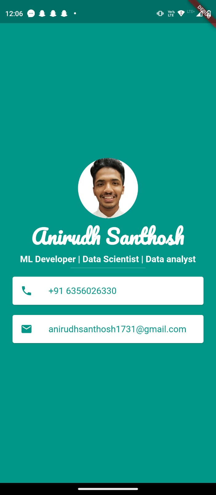

# FlutterProjects

## Project 1 - RichApp

  

## Project 2 - Buisness Card

  

Here , The project helped to learn to ,
--> Use of **stateless class** which helps in **Hot reload**.
--> Use of **Rows and Columns** 
--> Use of **Icon widget**
--> How to use **padding , margin**
--> How to **import fonts** from google and use it in the project
--> Use of **Cards and ListTile**
